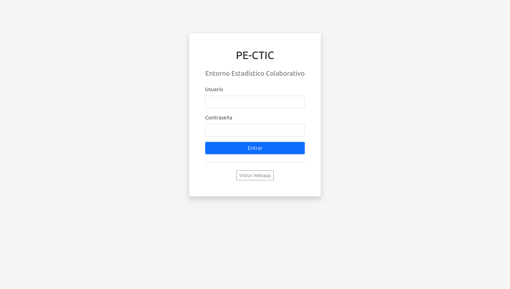
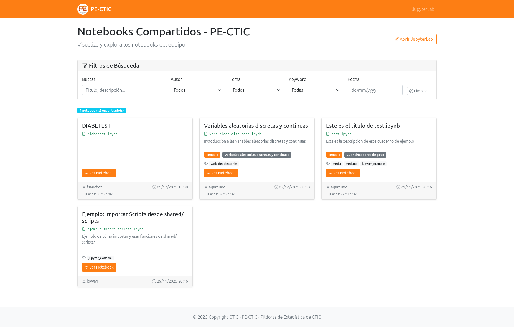
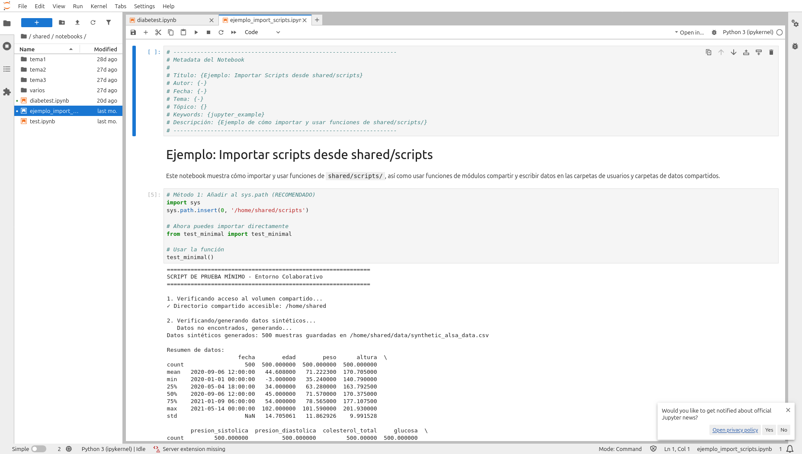

# PE-CTIC - Entorno Colaborativo Estadístico con Python

Entorno colaborativo simple para análisis de datos y desarrollo Python con JupyterLab, sistema de usuarios múltiples y visualización web de notebooks.

El **entorno** ya está lanzado y disponible en: https://pe-ctic.test.ctic.es/pe-ctic/.

La **web** está directamente disponible en: https://pe-ctic.test.ctic.es/pe-ctic/webapp/.







## 🚀 Inicio Rápido

### 1. Inicializar el Proyecto (Solo la Primera Vez)

```bash
# Dar permisos de ejecución
chmod +x init_project.sh

# Ejecutar inicialización
./init_project.sh
```

### 2. Configuración opcional (`.env`)

En la carpeta `PE-CTIC/` puedes copiar `.env.example` a `.env` y ajustar `SECRET_KEY`, LDAP y `PE_CTIC_ADMIN_USERNAMES`. Si no existe `.env`, Compose usa los valores por defecto del `docker-compose.yml`.

### 3. Iniciar el Entorno

```bash
# Construir e iniciar los contenedores
docker compose up -d

# Ver que todo está corriendo
docker compose ps
```

### 4. Acceder al Sistema

1. Abre tu navegador
2. Ve a: **https://pe-ctic.test.ctic.es/pe-ctic/** (o `http://192.168.2.88/pe-ctic/` si tienes DNS y estás en la red interna)
3. **Login con usuario y contraseña de Active Directory (LDAP)** — mismas credenciales corporativas que en otros servicios CTIC (p. ej. EmilIA); configura `PE_CTIC_ADMIN_USERNAMES` si necesitas el panel `/admin`
4. Se redirige automáticamente a JupyterLab en `/lab`
5. ¡Listo! Ya puedes crear y editar notebooks

**Para cerrar sesión**: Desde JupyterLab, ve a `File` → `Log Out` o accede directamente al endpoint `/logout`

---

## 🔐 Acceso al Sistema

### Rutas Disponibles

- **`chomsky/pe-ctic/`** → Login de autenticación
- **`chomsky/lab`** → JupyterLab (requiere login)
- **`chomsky/pe-ctic/webapp/`** → Webapp pública para visualizar notebooks compartidos
- **`chomsky/`** → 404 (no hay página raíz)

**Webapp en puerto dedicado:** nginx también escucha el **4912** (mapeo configurable con `WEBAPP_DEDICATED_PORT` en `.env`). En ese puerto la webapp se sirve **en la raíz** (`/`, `/notebook/...`, `/static/...`, `/files/...`), sin el prefijo `/pe-ctic/webapp`, para que puedas mapear en HTTPS solo `host:puerto` sin tratar el path como subruta. El puerto **80** sigue usando `chomsky/pe-ctic/webapp/` como antes.

- `http://<host>:4912/` → índice de notebooks
- `http://<host>:4912/notebook/...` → vista de un notebook

Útil para enlazar solo la visualización sin pasar por el puerto 80 o para reglas de firewall / proxies frontales distintos.

### Flujo de Trabajo

1. **Login**: `chomsky/pe-ctic/` → Introduce usuario/contraseña
2. **Redirección automática**: Te lleva a JupyterLab (`/lab`) con sesión activa
3. **Trabajar**: Crea scripts/notebooks en `shared/` o `users/{username}/`
4. **Visualizar**: Ve a `chomsky/pe-ctic/webapp/` para ver notebooks compartidos
5. **Logout**: Desde JupyterLab, `File` → `Log Out` o accede a `chomsky/logout`

---

## 📁 Estructura del Proyecto

```
PE-CTIC/
├── auth/                      # 🔐 Servicio de autenticación
│   ├── Dockerfile
│   ├── app.py                # Aplicación Flask de autenticación
│   └── users_data/           # Datos de usuarios y tokens
│
├── jupyterlab/                # ⚙️ Configuración de JupyterLab
│   ├── Dockerfile
│   └── jupyter_lab_config.py
│
├── webapp/                    # 🌐 Aplicación web para visualizar notebooks
│   ├── Dockerfile
│   ├── app.py
│   ├── static/               # Logo y archivos estáticos
│   └── templates/
│
├── shared/                    # ⭐ RECURSOS COMPARTIDOS
│   ├── data/                 # Datos compartidos (CSV, JSON, etc.)
│   ├── scripts/              # Scripts Python compartidos
│   └── notebooks/            # Notebooks compartidos (aparecen en webapp)
│
├── users/                     # 📁 TRABAJO INDIVIDUAL
│   └── [nombre_usuario]/     # Directorios personales (uno por usuario)
│
├── nginx/                     # 🌐 Proxy reverso y enrutamiento
│   ├── Dockerfile
│   └── nginx.conf
│
├── docker-compose.yml
├── init_project.sh
└── README.md
```

### ¿Dónde Poner las Cosas?

| Qué quieres hacer | Dónde ponerlo | ¿Quién puede verlo? |
|------------------|---------------|---------------------|
| **Datos para compartir** | `shared/data/` | Todos |
| **Scripts para compartir** | `shared/scripts/` | Todos |
| **Notebooks para compartir** | `shared/notebooks/` | Todos (aparecen en webapp) |
| **Trabajo personal** | `users/tu_nombre/` | Lectura: todos, Escritura: todos (colaborativo) |

---

## 👤 Usuarios y LDAP

La autenticación es contra **LDAP / Active Directory** (misma idea que el servicio EmilIA `picture-uploader`: Castor por defecto, UPN `usuario@dominio`). Variables en `docker-compose` del servicio `auth`:

| Variable | Uso |
|----------|-----|
| `LDAP_SERVER_URI`, `LDAP_BASE_DN`, `LDAP_USER_UPN_SUFFIX` | Conexión al directorio (valores por defecto alineados con CTIC) |
| `PE_CTIC_ADMIN_USERNAMES` | Nombres cortos LDAP (separados por comas) con acceso a `/admin` |

En el **primer login** correcto se crea `users/{username}/` y `BIENVENIDO.txt` si no existían.

El script `auth/manage_users.py` ya no crea usuarios locales; muestra ayuda si se ejecuta.

### ⚠️ Sistema de Usuarios

**Todos los notebooks se ejecutan como usuario `jovyan`** (usuario común del contenedor). **NO hay aislamiento real entre usuarios** - es un sistema de **colaboración abierta**.

- ✅ Autenticación: solo quien tenga cuenta en el directorio LDAP puede acceder
- ✅ Organización: cada usuario tiene su carpeta (se crea en el primer acceso)
- ⚠️ **Cualquier usuario puede modificar archivos de otros** (todos ejecutan como `jovyan`)

---

## 💻 Cómo Trabajar

### Trabajar con Datos Compartidos

```python
# Cargar datos compartidos
import pandas as pd
df = pd.read_csv('/home/shared/data/synthetic_alsa_data.csv')

# Usar scripts compartidos
import sys
sys.path.insert(0, '/home/shared/scripts')
from test_minimal import test_minimal
test_minimal()
```

### Crear Notebooks

1. En JupyterLab, click en "New" → "Notebook"
2. Añade la cabecera de metadatos al inicio (ver formato abajo)
3. Escribe Python, Markdown, LaTeX
4. Ejecuta celdas con Shift+Enter
5. **Guarda en `shared/notebooks/`** para que aparezca en la webapp

**Formato de metadatos** (añadir al inicio del notebook):
```python
# ------------------------------------------------------------------
# Metadata del Notebook
#
# Título: {Tu título}
# Autor: {tu_usuario}
# Fecha: {dd/mm/yyyy}
# Tema: {número}
# Tópico: {tópico}
# Keywords: {keyword1, keyword2}
# Descripción: {Descripción breve}
# ------------------------------------------------------------------
```

⚠️ **Importante**: Evita espacios y caracteres especiales en nombres de archivos y rutas. Usa guiones bajos (_) o guiones (-) en lugar de espacios.

### Explorar la Estructura

En el panel izquierdo de JupyterLab verás:
- **Home** (`/home/jovyan`) - Tu directorio de trabajo
- **shared** (enlace simbólico) - Recursos compartidos
- **users** (enlace simbólico) - Directorios de usuarios

---

## 🐛 Solución de Problemas

### Reiniciar servicios
```bash
docker compose restart [servicio]  # Reiniciar un servicio específico
docker compose down && docker compose up -d  # Reiniciar todo
```

### Ver logs
```bash
docker compose logs [servicio]  # Ver logs de un servicio
docker compose logs -f  # Seguir logs en tiempo real
```

### Problemas comunes

- **No puedo acceder a JupyterLab**: Accede a través de `chomsky/pe-ctic/` (no directamente a `/lab`)
- **Permisos**: Ejecuta `./fix_permissions.sh` si hay problemas de permisos
- **Servicios no inician**: Verifica con `docker compose ps`

---

## 📝 Notas Importantes

- **Autenticación**: Solo usuarios registrados pueden acceder a JupyterLab
- **Webapp**: Pública (sin autenticación) para visualizar notebooks compartidos
- **Colaboración**: Todos los usuarios pueden ver y modificar archivos en `shared/` y `users/`
- **Metadatos**: Los notebooks en `shared/notebooks/` con metadatos aparecen automáticamente en la webapp
- **Logo**: Se encuentra en `webapp/static/logo.png`

---

**PE-CTIC** - _Píldoras de Estadística de CTIC_ - Entorno colaborativo de estadística aplicada con Python
